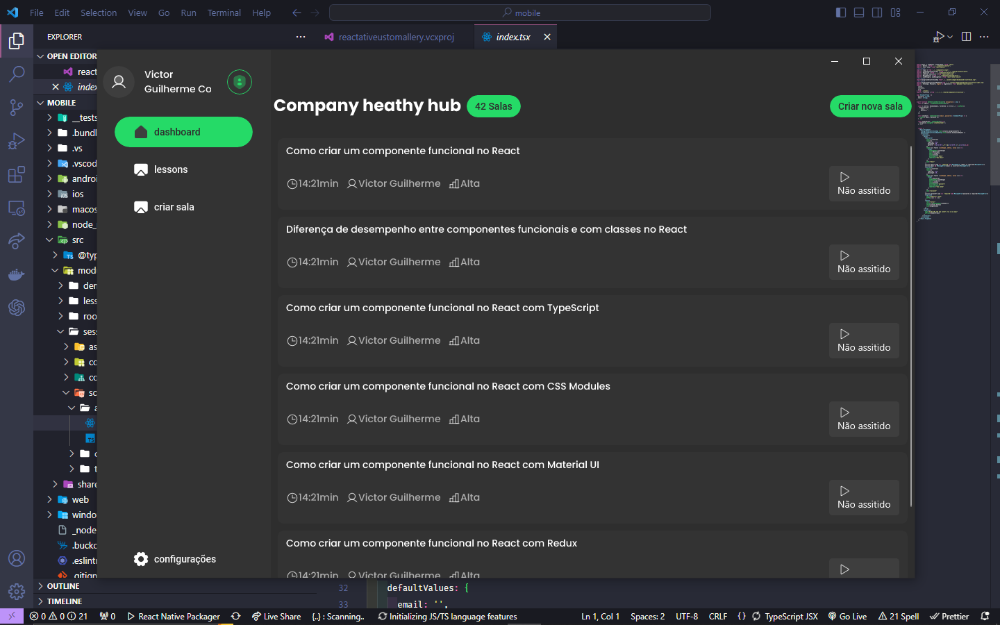

# gallery-rnw

  
  

## Desktop

### Description

O EduSphere é um software de chat e aulas projetado para tornar o processo de comunicação entre educadores e alunos mais prático e eficaz. Ele facilita a interação ao mesmo tempo em que oferece uma estrutura de comunicação sólida e simples.

## Mobile
<!--  -->

### Description

Construído usando a tecnologia React Native, ele oferece suporte às plataformas Android e iOS, tornando o processo de desenvolvimento rápido e fácil. Isso permite aproveitar os melhores recursos das plataformas móveis para estudar e manter-se atualizado.

## Web
<!--  -->

### Description

Construído utilizando a tecnologia Next.js e oferecendo suporte à plataforma web, torna o processo de desenvolvimento de plataforma rápido e fácil, incorporando as mais recentes e poderosas funcionalidades que a web disponibiliza.
